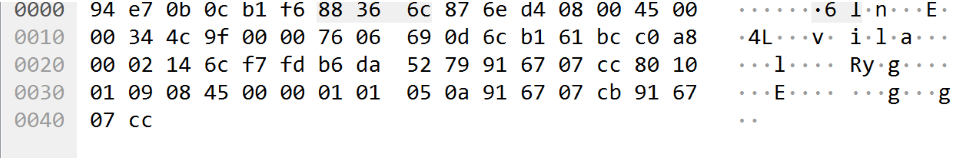

# IP Header의 필드 값의 의미

- 45 00 = Version4의 값
- 00 34 = total length
- 4c 9f = identification
- 00 00 = flags
- 76 06 = TTL , 118과 프로토콜, TCP
- 6C B1 61 BC = 출발지 IP
- C0 A8 00 02 = 목적지 IP

## 내컴터가 보내는 IP패킷의 TTL값은 고정인가 ? (TTL:Time To Live)
- OS마다 기본 TTL 값이 있다. 리눅스는 기본값이64, 윈도우는 128임.

