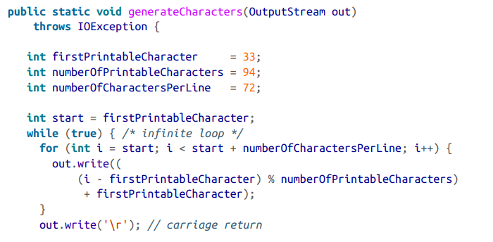
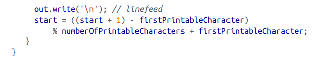
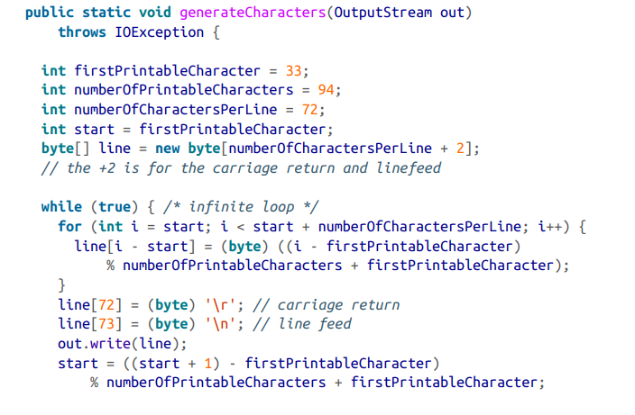

# Stream
- input stream이 read 함수랑 연결
- output stream 은 write 함수랑 연결

# OutputStream의 fundamental methods / java's basic output class = java.io.OutputStream;(public abstract class OutputStream)
- public abstract void write(int b) throws IOException
- public void write(byte[] data) throws IOException
- public void write(byte[] data, int offset, int length)
 throws IOException
- public void flush() throws IOException
- public void close() throws IOException

- fundamental method = write(int b) -> 이 메서드는 0에서 255 사이의 정수를 인수로 사용하고 해당 바이트를 출력 스트림에 씁니다.

# InputStream의 fundamental methods / java's basic input class = java.io.InputStream;(public abstract clss InputStream)
- public abstract int read() throws IOException
- public int read(byte[] input) throws IOException
- public int read(byte[] input, int offset, int length) throws IOException
- public long skip(long n) throws IOException
- public int available() throws IOException
- public void close() throws IOException

- basic method = read() -> 이 메서드는 입력 스트림의 원본에서 데이터의 단일 바이트를 읽고 0에서 255까지의 int로 반환합니다.

- signed byte를 unsigned byte로 변환하는 법 => int i= b>=0 ? b : b+256;

## FileOutputStream,FileInputStream
- 데이터를 파일안에 작성,읽어올 때 사용

## TelnetOutputStream,TelnetInputStream
- 데이터를 네트워크 연결에 작성,읽어올 때 사용

## ByteArrayOutputStream,ByteArrayInputStream
- 데이터를 확장가능한 바이트 배열에 작성,읽어올 때 사용

- OutputStream 단일 code

- OutputStream 배열 code

